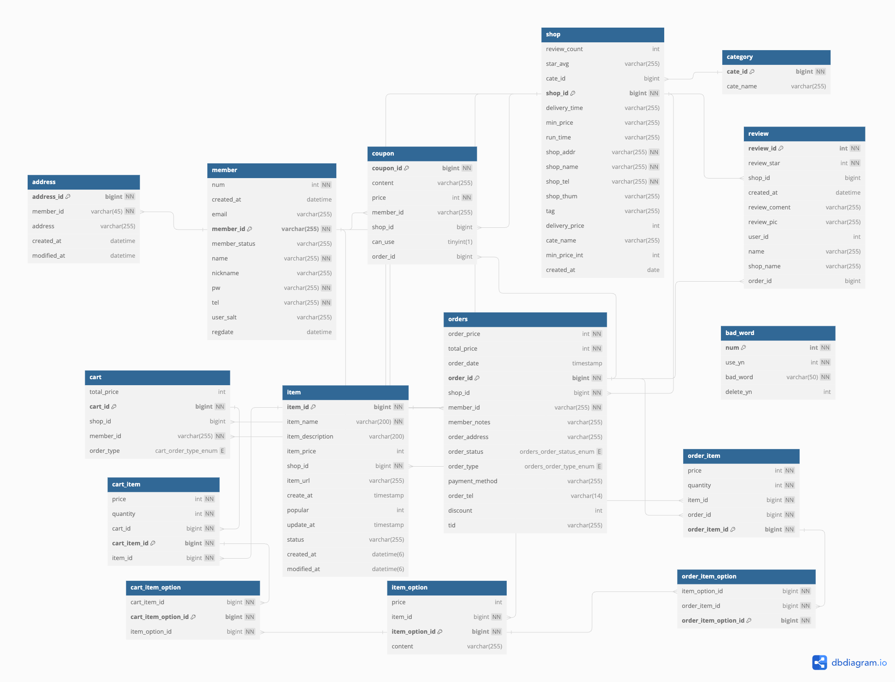
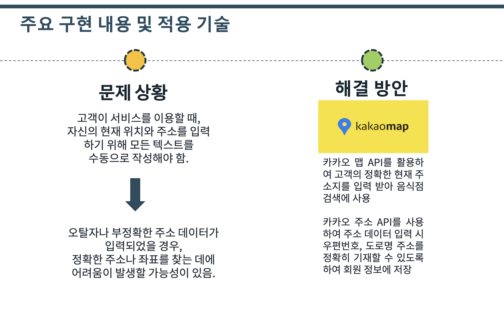
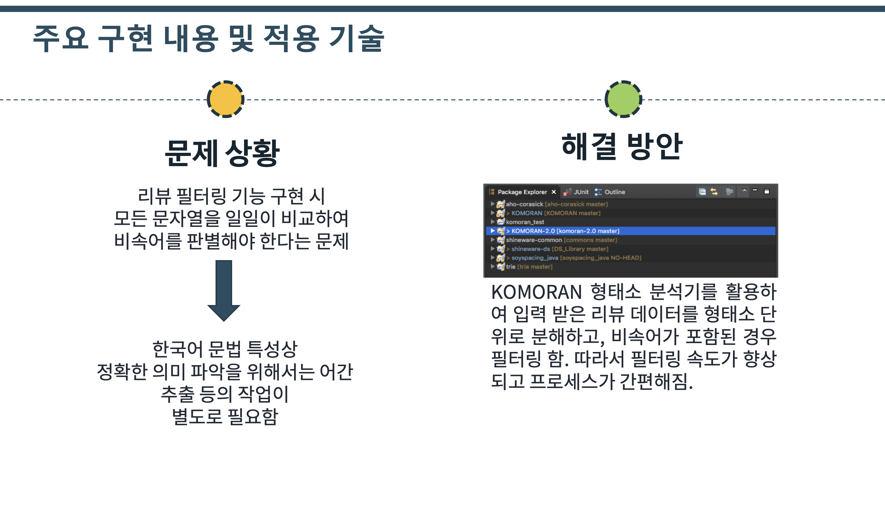
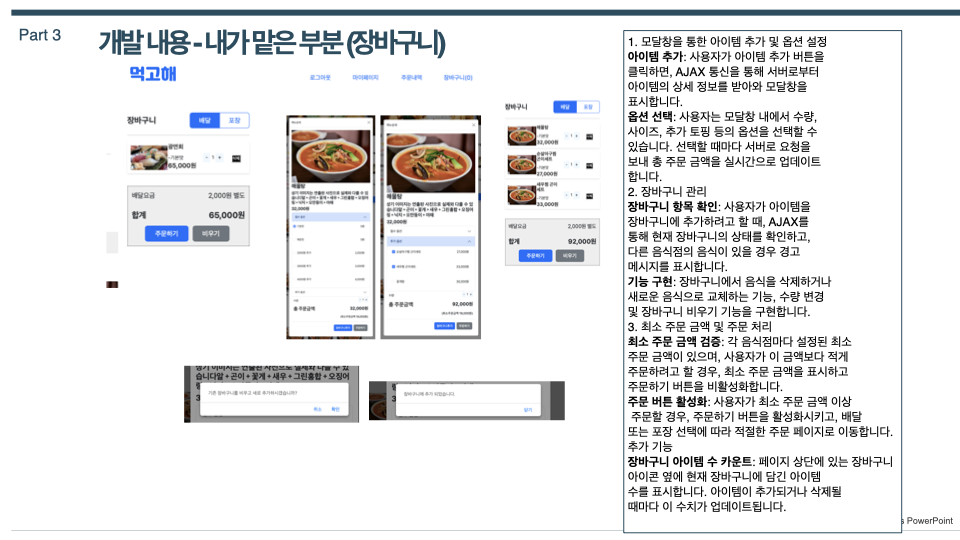
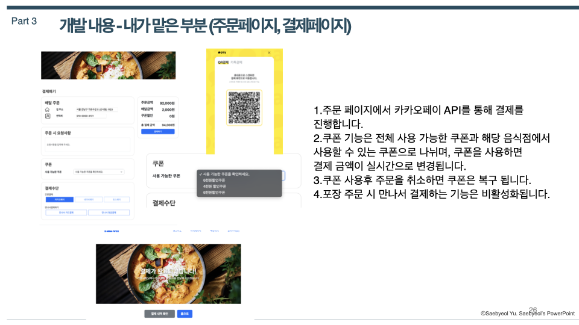
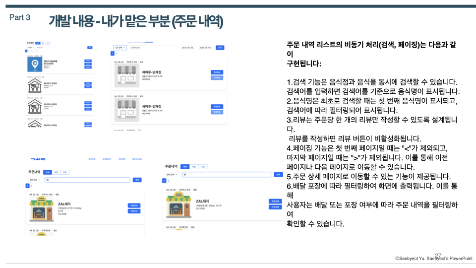
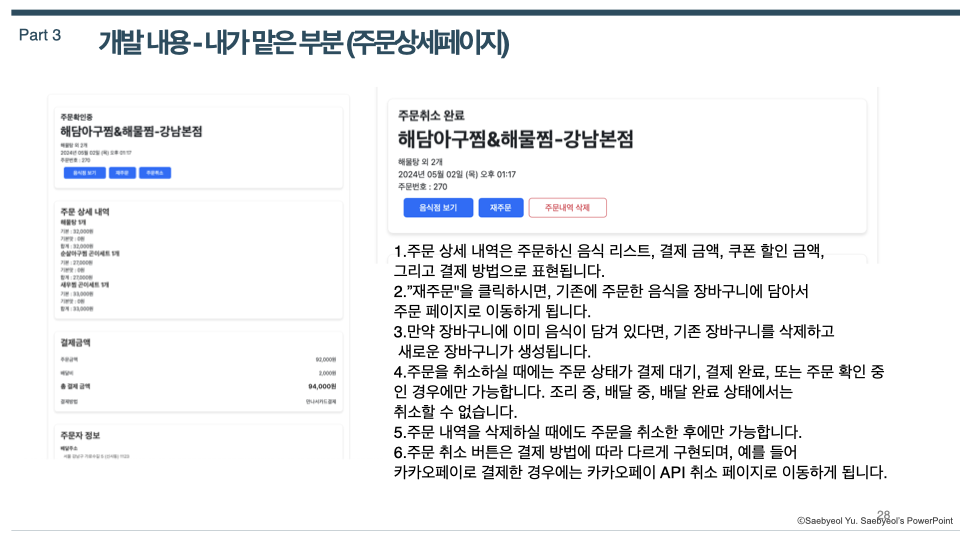

# :pushpin: 먹고해
>위치 기반 api를 활용한 편리한 주변 음식점 검색과
>리뷰 필터링 나쁜리뷰어를 필터링해 쾌적한 배달 서비스    

 

## 1. 제작 기간 & 참여 인원
- 2024년 3월 22일 ~ 2024년 5월 2일
- 팀 프로젝트(4명)

 

## 2. 사용 기술
#### `Back-end`
  - Java 17
  - Spring Boot 3.2.4
  - Gradle
  - Spring Data JPA
  - MySQL 8.0.35
  - Mybatis
#### `Front-end`
  - javascript
  - bootstrap 5.3.3
  - html / css

 

## 3. ERD 설계

## 4. 핵심 기능
이 서비스의 핵심 기능은 위치 기반 api 를 활용한 음식점 검색 기능과
komoran api를 활용한 형태소 분석을 통한 리뷰 필터링 기능입니다.
  

<b>핵심 기능 설명 펼치기</b>

### 4.1. 위치 api

### 4.2. komoran api

 

## 5. 내가 맡은 기능

### 5.1 장바구니

### 5.2 주문(kakaopay api)

### 5.3 주문내역

### 5.4 주문 상세내역

 

## 6. 그 외 트러블 슈팅

Mysql 설치 오류

- 팀원 한명 한글 계정으로 mysql 설치가 안되는 오류 발생
- 남는 pc를 통합 db로 사용
- 외부접속 허용계정 생성 후 공유기 포트포워딩으로 mysql포트 열고 외부 ip주소로 접속해서 통합 db로 해결 서버화

thmeleaf ncp 배포시에 뷰 경로 못찾는 이슈

  
  - return "/~/~"; 로 작성시에 properties에서 classpath /를 제거하거나 return 에서 /를 제거 중복되면 경로를 못찾음
  

Mybatis sql 문 대소문자 구분 문제

  
  - ncp 배포 시에 db가 우분투 5.7버전 mysql이라 기본 설정이 대소문자 구분임
  - 대소문자 구분해서 작성하거나 설정을 바꿔주면 해결
  

Https 문제

  
  - ssl 인증서가 있어야 https로 접속이 가능한것을 알고 aws ec2로 개인 우분투 서버를 생성후 nginx를 활용해 ssl 인증서를 적용해서 https 접속 성공
  - 하지만 이미지 경로를 절대경로로 설정하지 않아 이미지가 안나오고 css도 적용되지 않았다
  - 페이지 이동도 되지 않아 추후 공부를 통해 오류를 해결할 생각이다.
  

    

    
 

## 7. 회고 / 느낀점
> 처음 만들어 본 프로젝트라 기획부터 어려움이 있었지만 수많은 구글링과 유사 프로젝트들을 참고하며 방향성을 잡고 다른 팀원들에게 피해를 주지 않기 위해 밤늦게까지 공부를 했던게 나중에 개발단계에서 아주 많은 도움이 됐던거 같다. 코드 작성할때도 우선을 작동만 되게 하자는 마인드로
> 코드를 작성하였다. 지금은 경험이 부족해 아는것이 있어도 완벽하게 활용하거나 상황에 맞는 코드 작성이 미숙하지만 경험을 바탕으로 더 노력해서 깔끔한 코딩을 하고싶다. 그래서 지금 프로젝트도 모든 기능을 내가 다시 리팩토링 할 생각이다.
> 이론만 배우다가 프로젝트를 하면서 배운것을 적용하니 훨씬더 많이 공부가 되는것을 느꼈다. 프로젝트를 리팩토링하면서 실력이 더욱 향상될것으로 기대하고 있다. 
