**#먹고해 **프레젠테이션

ⓒSaebyeol Yu. Saeby1eol’s PowerPoint

**목차** table of contents 

1  프로젝트 개요 
1  프로젝트 설계 
1  개발 내용 
1  시연 
1  추후 계획 및 개발후기 

ⓒⓒSaSaeebbyyeeooll  YYuu..  SaSaeebby2yeeooll’’ss  PoPowweerPorPoiinntt

**1 ![ref1]프로젝트 개요**

ⓒSaebyeol Yu. Saeby4eol’s PowerPoint
Part 6 **프로젝트  개요**

![ref2]

 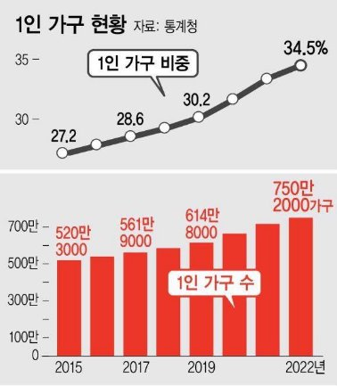

출저 - 조선일보 출저 – 한겨레

**#먹고해**

**음식배달을 벤치마킹한 웹 서비스** 

1인 가구의 증가와 함께 일상 속에서 선택과 집중의 삶을 살고 있는 사회인들 에게 위치정보 제공 및 자연어처리 기술을 활용한 배달 서비스를 제공함으로 

인해 더 윤택한 삶이 되도록 도움을 주는 서비스.

ⓒSaebyeol Yu. Saeb6yeol’s PowerPoint
Part 7 **프로젝트 멤버**

김창범

담당 업무          front-end: 보조      Back-end: 회원가입 기능



엄도원

담당 업무 Back-end: 

결제 기능, 주문 기능, 장바구니 기능



이민혜

담당 업무 Back-end: 

음식점 기능, 리뷰 기능



정예빈

담당 업무 front-end: 담당 Back-end: 

회원 기능, 관리자 기능, 쿠폰 기능, 데이터 크롤링

ⓒSaebyeol Yu. Saeb7yeol’s PowerPoint
Part 8 **프로젝트 절차![ref2]**

|**구분**|**기간**|**활동**|**비고**|
| - | - | - | - |
|기획|2024\. 03. 22 – 2024. 03.27.|팀원 구성 및 프로젝트 방향성 설정||
|설계|2024\. 03. 28 – 2024. 04.04.|프로젝트 흐름과 구조화 하기||
|개발|2024\. 04. 05 – 2024. 04.25.|업무명세 구현||
|테스트|2024\. 04. 26 – 2024. 04.29.|모듈 병합과 베타 테스트||
|배포|2024\. 04. 30 – 2024. 05.01.|클라우드 환경 배포||

ⓒSaebyeol Yu. Saeb8yeol’s PowerPoint
Part 9 **프로젝트 기술**

FRONT-END

**Figma VScode Javascript HTML**

**CSS**

BACK-END

 **Spring-boot MySQL**

**mybatis**

**JAVA JPA**

DATA CRAWLING

**Python**

TOOLS

**Notion Github**

**Slack InteljJ IDEA**

ⓒSaebyeol Yu. Saeb9yeol’s PowerPoint

Part 1 **우리조의 장점![ref3]**

||**중도에 2명의 퇴소가 있었지만,**||
| :- | - | :- |
||||
출저 – 축구대표팀 트위터 캡처

ⓒSaebyeol Yu. Saeb11yeol’s PowerPoint![ref4]

**2 ![ref1]프로젝트 설계**

ⓒSaebyeol Yu. Sae1by0eol’s PowerPoint

Part 2 **클래스 다이어그램 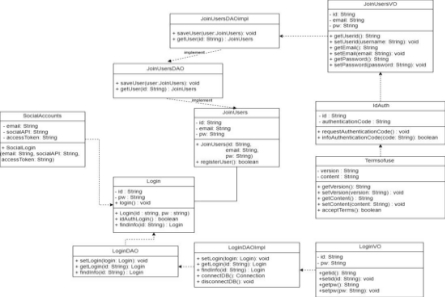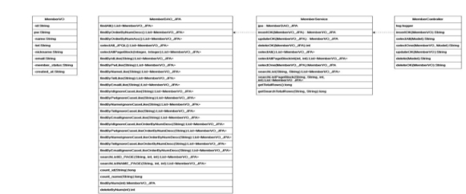![ref3]**

 ⓒSaebyeol Yu. Sae1b1yeol’s PowerPoint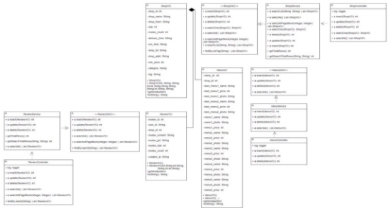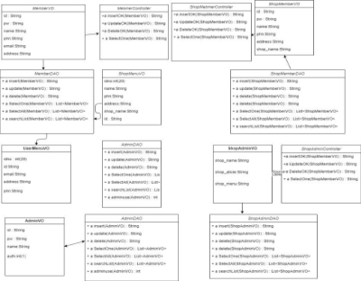![ref4]

Part 2 **ERD![ref3]**

` `![ref5]

ⓒSaebyeol Yu. Sae2b2yeol’s PowerPoint![ref4]
Part 2 **ERD![ref3]**

` `![ref5]

ⓒSaebyeol Yu. Sae2b2yeol’s PowerPoint![ref4]

**3 ![ref1]개발 내용**

ⓒSaebyeol Yu. Sae3by3eol’s PowerPoint

Part 3 **프로젝트 절차![ref3]**

ⓒSaebyeol Yu. Sae4b4yeol’s PowerPoint![ref4]

Part 3 **개발 목록![ref3]**

**전체 기능**

**349**

**음식점 기능 64 리뷰 기능 40**

**주문 기능 48 결제 기능 6 장바구니 기능 30 관리자 기능 48**

**회원 기능 57 데이터 크롤링 2**

**프론트 엔드 기능  54** ⓒSaebyeol Yu. Sae1b5yeol’s PowerPoint![ref4]

Part 3 **개발 내용(세부)![ref3]**

음식점 기능(64) 장바구니 기능(30)

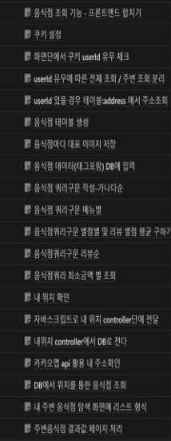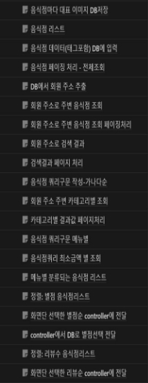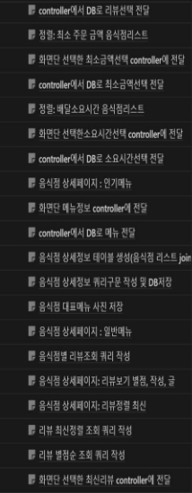 

Part 3 **개발 내용 ![ref3]**

주문 기능(48) 리뷰 기능(40)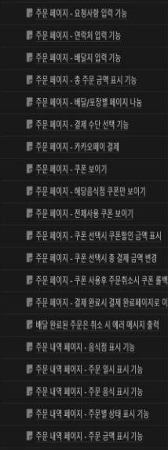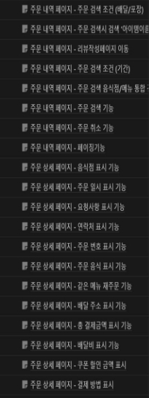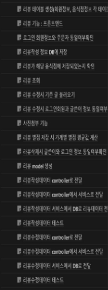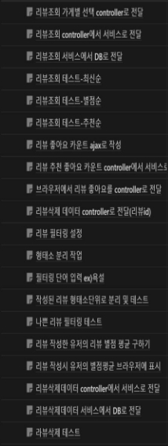

ⓒSaebyeol Yu. Sae9b9yeol’s PowerPoint![ref4]
Part 13 **개발 내용![ref3]**

회원 기능(57) 결제 기능(6) 데이터 크롤링 (2)

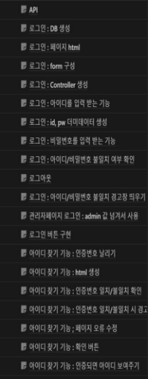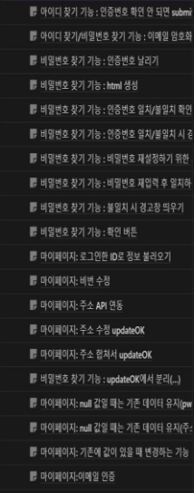  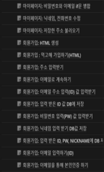

프론트 엔드(54) 관리자 기능(48)

` `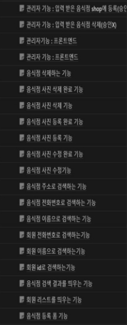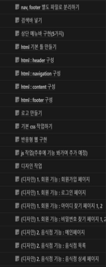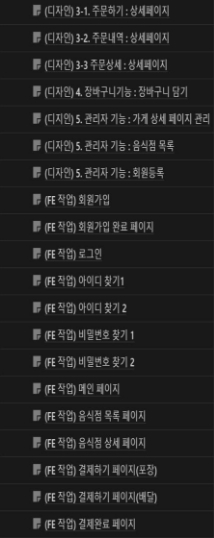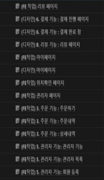

ⓒSaebyeol Yu. Sae13b13yeol’s PowerPoint![ref4]
Part 3 **주요 구현 내용 및 적용 기술![ref3]![ref6]**

**문제 상황 해결 방안**

고객이 서비스를 이용할 때,

자신의 현재 위치와 주소를 입력

하기 위해 모든 텍스트를 

수동으로 작성해야 함. 카카오 맵 API를 활용하

여 고객의 정확한 현재 주 소지를 입력 받아 음식점 검색에 사용

카카오 주소 API를 사용 오탈자나 부정확한 주소 데이터가  하여 주소 데이터 입력 시 

입력되었을 경우, 우편번호, 도로명 주소를 정확한 주소나 좌표를 찾는 데에  정확히 기재할 수 있도록 어려움이 발생할 가능성이 있음. 하여 회원 정보에 저장

ⓒSaebyeol Yu. Sae3b0yeol’s PowerPoint![ref4]
Part 1 **구현 영상![ref3]**

카카오맵 API 적용 영상 카카오 주소 API 적용 영상

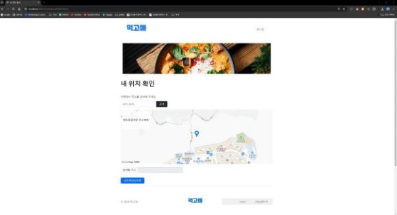 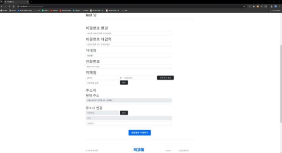

ⓒSaebyeol Yu. Sae1b1yeol’s PowerPoint![ref4]
Part 2 **주요 구현 내용 및 적용 기술![ref3]![ref6]**

**문제 상황 해결 방안**

ⓒSaebyeol Yu. Sae2b2yeol’s PowerPoint![ref4]
Part 3 **주요 구현 내용 및 적용 기술![ref3]![ref6]**

리뷰 필터링 기능 구현 시 모든 문자열을 일일이 비교하여 비속어를 판별해야 한다는 문제

한국어 문법 특성상         정확한 의미 파악을 위해서는 어간 추출 등의 작업이

별도로 필요함



KOMORAN형태소 분석기를 활용하 여 입력 받은 리뷰 데이터를 형태소 단 위로 분해하고, 비속어가 포함된 경우 필터링 함. 따라서 필터링 속도가 향상 되고 프로세스가 간편해짐.

ⓒSaebyeol Yu. Sae3b3yeol’s PowerPoint![ref4]
Part 4 **구현 영상![ref3]**

KOMORAN 형태소 분석기를 활용한 리뷰 필터링 실제 작동 영상

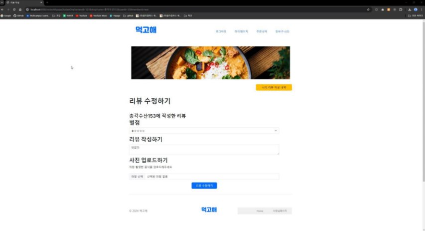

ⓒSaebyeol Yu. Sae4b4yeol’s PowerPoint![ref4]

**4 ![ref1]시연**

ⓒSaebyeol Yu. Sae5by5eol’s PowerPoint

Part 4 **시연![ref7]**

**시연**

별도

ⓒSaebyeol Yu. Sae6b6yeol’s PowerPoint

**5 ![ref1]추후 계획**

ⓒSaebyeol Yu. Sae7by7eol’s PowerPoint

Part 5 **추후 계획**

ⓒSaebyeol Yu. Sae8b8yeol’s PowerPoint

**주문상태 실시간 알림**

웹소캣 이용 실시간으로 주문하면 사장님페이지 에서 주문확인 가능 및 주문 상태 변경됨으로 회원한테 주문상태 실시간 알림 예정



**Python 인공신경망** 

파이썬 인공신경망 모델 이용하여 리뷰 필터링 기능 향상 예정



**비회원 주문** 

비로그인  상태에서도  주문 가능하도록 구현 예정

ⓒSaebyeol Yu. Saebyeol’s PowerPoint

Part 5 **개발 후기**

|▪|좋은 팀원들 만나서 1달 동안 같이 고민하면 |▪ 머리로만 배우다가 직접 몸으로 부딪혀 보니 |
| - | - | - |
||좋은 결과물을 만들어 내서 기쁘다. |내 스스로 성장했다는 게 체감 될 정도로 느껴진다. |
||중도에 퇴소라는 변수가 발생했지만, |좋은 팀을 만나 좋은 경험을 한 것 같다. |
||남은 팀원들과 힘을 합쳐 앞으로 나아갔다.|다들 원하는 목표를 이루시길 바란다.|
||중요한 것은 꺾이지 않는 마음. **김창범**|**엄도원**|
||**이민혜**|**정예빈**|
|▪|혼자가 아닌 여러 명과 협업하면서 커뮤니케이션|▪ 1달간 좋은 팀원들과 값진 경험하다가 가는 것 |
||의 중요성을 깨달은 소중한 경험이었습니다. |같습니다! 앞으로도 다들 화이팅|

Part 5 **마무리![ref7]**

**Thank you for listening.**

-END-
ⓒSaebyeol Yu. Sae10b10yeol’s PowerPoint

[ref1]: Aspose.Words.9335fb55-a08c-40d9-81d9-b7ab31ff8407.004.png
[ref2]: Aspose.Words.9335fb55-a08c-40d9-81d9-b7ab31ff8407.006.png
[ref3]: Aspose.Words.9335fb55-a08c-40d9-81d9-b7ab31ff8407.022.png
[ref4]: Aspose.Words.9335fb55-a08c-40d9-81d9-b7ab31ff8407.024.png
[ref5]: Aspose.Words.9335fb55-a08c-40d9-81d9-b7ab31ff8407.030.jpeg
[ref6]: Aspose.Words.9335fb55-a08c-40d9-81d9-b7ab31ff8407.062.png
[ref7]: Aspose.Words.9335fb55-a08c-40d9-81d9-b7ab31ff8407.073.png
